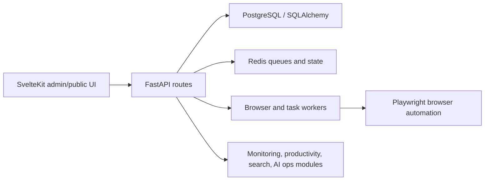

# Personal Hub

Personal Hub is a self-hosted operations workspace built from a long-running private project. It combines page monitoring, productivity tools, AI-assisted workflow orchestration, search utilities, document/image processing, and admin dashboards in one FastAPI + SvelteKit application.

This public repository preserves the development history while removing private secrets, local operating data, and automated transaction execution code. The history was rewritten from the private `monitor-page` lineage before publication.

## Highlights

- Monitoring workflows for travel, pop-up, marketplace, Instagram, Kakao, and custom availability signals
- Productivity modules for notes, writing, books, reports, file search, file classification, image classification, and slide scanning
- AI operations infrastructure including plan execution, worker/session tracking, archive analysis, and runtime status surfaces
- Backend stack: FastAPI, SQLAlchemy, Alembic, PostgreSQL, Redis, Playwright, pytest
- Frontend stack: SvelteKit, TypeScript, Vite, Tailwind-style utility classes
- Development history: 4,000+ commits retained after public sanitization, spanning 2024-06-21 through 2026-06-04

## Architecture



## Local Setup

```powershell
python -m venv .venv
.\.venv\Scripts\pip install -r requirements.txt
cd frontend
npm install
```

Create `.env` from `.env.example` and `frontend/.env.example`. Real credentials are intentionally absent.

## Run

```powershell
.\.venv\Scripts\python -m uvicorn app.main:app --reload
cd frontend
npm run dev
```

## Test

```powershell
.\.venv\Scripts\pytest
cd frontend
npm run check
```

Some tests and workflows expect local PostgreSQL, Redis, browser profiles, or private operating data. Treat this repository as a source and architecture showcase unless you have supplied equivalent local configuration.

## Public Sanitization

Before publication, the repository history was scanned with gitleaks and rewritten with `git-filter-repo`. Removed content includes tracked `.env` history, local backup files containing tokens, private agent/mirror surfaces, and automated transaction execution code. Monitoring and general-purpose proxy/data collection infrastructure are retained for personal and educational use.
