# 모니터링 시스템 설계서

## 1. 개요
이 문서는 모니터링 시스템의 주요 클래스와 그 관계를 다이어그램으로 표현하고, 시스템의 설계 및 구현 세부사항을 설명합니다.

## 2. 클래스 다이어그램

```mermaid
classDiagram
    class MonitoringSystemManager {
        -_monitoring_tasks: Dict[str, asyncio.Task]
        -_status_cache: Dict[str, Dict[str, Any]]
        -_error_counts: Dict[str, int]
        -_last_errors: Dict[str, str]
        -_last_checks: Dict[str, datetime]
        -_maintenance_mode: bool
        -_scheduled_maintenance: Dict[str, datetime]
        -_concurrent_checks: Set[str]
        -_executor: ThreadPoolExecutor
        -_check_semaphore: asyncio.Semaphore
        -notification_service: NotificationService
        -browser_service: BrowserService
        -_monitoring_queue: asyncio.Queue
        -_active_monitors: Set[str]
        -_max_concurrent: int
        -_queue_processor_task: asyncio.Task
        +__init__(notification_service, browser_service)
        +_init_db()
        +_get_connection()
        +get_targets(filter_params)
        +extract_date_from_url(url)
        +calculate_interval(start_date_str)
        +_convert_to_model(db_target)
        +create_target(target_data)
        +get_target(target_id)
        +update_target(target_id, target_data)
        +delete_target(target_id)
        +get_targets_by_service(service_type)
        +get_targets_by_category(category)
        +get_active_targets()
        +fix_invalid_times()
        +start_queue_processor()
        +stop_queue_processor()
        +add_to_queue(target)
        +_process_queue()
        +_monitor_loop(target, service)
        +start_monitoring(target)
        +stop_monitoring(target_id)
        +_has_status_changed(target_id, new_status)
        +get_monitoring_status()
        +get_target_status(target_id)
        +reset_target_status(target_id)
        +start_all_monitoring()
        +stop_all_monitoring()
        +restart_monitoring(target_id)
        +update_monitoring_interval(target_id, interval)
        +set_maintenance_mode(enabled)
        +schedule_maintenance(target_id, start_time, duration)
        +_end_maintenance(target_id, end_time)
        +get_maintenance_schedule()
        +get_concurrent_checks()
        +cleanup_old_status(days)
        +get_performance_metrics()
        +check_status(target)
        +handle_status_change(target, new_status)
        +get_interval(target)
        +validate_target(target)
    }

    class BrowserService {
        -_browser: Browser
        -_context: BrowserContext
        -_tabs: Dict[int, Page]
        -_tab_locks: Dict[int, asyncio.Lock]
        -_monitoring_tasks: Dict[int, asyncio.Task]
        -_monitoring_queue: asyncio.Queue
        -_queue_processor_task: asyncio.Task
        -_resource_monitor_task: asyncio.Task
        -_monitor_service: MonitoringSystemManager
        -_next_run_times: Dict[int, float]
        -_last_run_dates: Dict[int, datetime]
        -_tab_pools: Dict[int, Dict[str, Page]]
        -_tab_last_used: Dict[int, Dict[str, float]]
        -_tab_in_use: Dict[int, Dict[str, bool]]
        -_memory_stats: Dict[int, Dict]
        -_last_memory_check: Dict[int, float]
        -_resource_cleanup_task: asyncio.Task
        -_tab_request_queues: Dict[int, asyncio.Queue]
        -_tab_waiters: Dict[int, Dict[str, asyncio.Event]]
        -_total_active_tabs: int
        -_browser_contexts: Dict[int, BrowserContext]
        -_tab_rotation_count: Dict[int, int]
        +__init__(monitor_service)
        +initialize()
        +start_resource_monitoring_async()
        +start_resource_monitoring()
        +monitor_resources()
        +check_worker_memory(target_id)
        +cleanup_target_resources(target_id)
        +perform_global_cleanup()
        +initialize_browser()
        +_bypass_automation_detection(context)
        +cleanup_old_tabs(target_id, force_cleanup)
        +get_tab(target_id)
        +release_tab(tab)
        +load_page(tab, url)
        +monitor_url(target_id, url, label)
        +handle_change(target_id, url, label, content, last_check_time)
        +start_monitoring(data)
        +_process_monitoring_queue()
        +_check_queue_after_task_completion()
        +stop_monitoring(target_id)
        +add_to_monitoring_queue(target_data)
        +process_initial_queue(max_items)
        +perform_monitoring(tab, url, target_id, label)
        +_calculate_next_run_time(target)
    }

    class AbstractSiteMonitor {
        <<abstract>>
        #notification_service: NotificationService
        +__init__(notification_service)
        +check_status(target, page)
        +handle_status_change(target, new_status)
        +get_interval(target)
        +validate_target(target)
    }

    class NaverSiteMonitor {
        -browser_service: BrowserService
        -session: aiohttp.ClientSession
        +__init__(notification_service, browser_service)
        +initialize()
        +cleanup()
        +check_status(target)
        +handle_status_change(target, new_status)
        +get_interval(target)
        +validate_target(target)
        +check_availability(target)
        +get_monitoring_interval(target)
    }

    class CoupangSiteMonitor {
        -browser_service: BrowserService
        -previous_item_statuses: Dict
        -last_check_times: Dict
        -max_retries: int
        -retry_delay: int
        -log_dir: Path
        -monitoring_start_time: str
        -status_log_file: Path
        -api_response_log_file: Path
        -api_request_log_file: Path
        +__init__(notification_service, browser_service)
        +check_status(target, page)
        +_fetch_vendor_items_with_retry(page, product_id, select_date)
        +_extract_dates(url)
        +_extract_product_id(url)
        +_fetch_vendor_items(page, product_id, select_date)
        +_analyze_vendor_items(vendor_items, date, current_time, current_item_statuses)
        +_send_status_change_notifications(status_changes, current_time)
        +_log_api_request(product_id, select_date)
        +_log_api_response(data, date, request_successful, error_message)
        +_log_status_change(item_name, old_status, new_status, stock_count, date)
        +get_interval(target)
        +validate_target(target)
    }

    class SiteMonitorFactory {
        +_services: Dict[ServiceType, Type[AbstractSiteMonitor]]
        +create_service(target, notification_service, browser_service)
    }

    class NotificationService {
        +__init__()
        +send_notification(message, state)
    }

    class MonitorTarget {
        +id: int
        +url: str
        +base_url: str
        +label: str
        +date: str
        +times: List[str]
        +category: str
        +service_type: str
        +is_active: bool
        +is_enabled: bool
        +run_status: str
        +last_error: str
        +error_count: int
        +interval: float
        +custom_interval: bool
        +created_at: datetime
        +updated_at: datetime
        +dict()
        +model_dump()
    }

    class DBMonitorTarget {
        +id: int
        +url: str
        +base_url: str
        +label: str
        +date: str
        +times: str
        +category: str
        +service_type: str
        +is_active: bool
        +is_enabled: bool
        +run_status: str
        +last_error: str
        +error_count: int
        +interval: float
        +custom_interval: bool
        +created_at: datetime
        +updated_at: datetime
    }

    class DBNotificationSettings {
        +id: int
        +enable_telegram: bool
        +enable_desktop: bool
        +notify_states: str
    }

    MonitoringSystemManager --> BrowserService : contains
    MonitoringSystemManager --> NotificationService : contains
    MonitoringSystemManager --> AbstractSiteMonitor : creates
    MonitoringSystemManager --> DBMonitorTarget : manages
    MonitoringSystemManager --> DBNotificationSettings : manages
    BrowserService --> MonitoringSystemManager : references
    AbstractSiteMonitor <|-- NaverSiteMonitor : extends
    AbstractSiteMonitor <|-- CoupangSiteMonitor : extends
    NaverSiteMonitor --> BrowserService : contains
    CoupangSiteMonitor --> BrowserService : contains
    SiteMonitorFactory --> AbstractSiteMonitor : creates
    SiteMonitorFactory --> NaverSiteMonitor : creates
    SiteMonitorFactory --> CoupangSiteMonitor : creates
    SiteMonitorFactory --> NotificationService : injects
    SiteMonitorFactory --> BrowserService : injects
```

## 3. 클래스 설명

### 3.1 MonitoringSystemManager
모니터링 시스템의 핵심 관리자 클래스로, 모든 모니터링 작업을 조정하고 관리합니다. 데이터베이스 작업, 모니터링 대상 관리, 상태 추적 등을 담당합니다.

#### 주요 속성
- `_monitoring_tasks`: 모니터링 태스크를 저장하는 딕셔너리
- `_status_cache`: 모니터링 상태 캐시
- `_error_counts`: 오류 발생 횟수 추적
- `_last_errors`: 마지막 오류 메시지 저장
- `_last_checks`: 마지막 확인 시간 저장
- `_maintenance_mode`: 유지보수 모드 상태
- `_scheduled_maintenance`: 예약된 유지보수 시간
- `_concurrent_checks`: 동시 실행 중인 확인 작업
- `_monitoring_queue`: 모니터링 대기열
- `_active_monitors`: 활성화된 모니터링 대상
- `_max_concurrent`: 최대 동시 실행 수

#### 주요 메서드
- `get_targets()`: 모니터링 대상 목록 조회
- `create_target()`: 새 모니터링 대상 생성
- `update_target()`: 모니터링 대상 정보 업데이트
- `start_monitoring()`: 모니터링 시작
- `stop_monitoring()`: 모니터링 중지
- `get_monitoring_status()`: 모니터링 상태 조회
- `calculate_interval()`: 모니터링 간격 계산

### 3.2 BrowserService
브라우저 인스턴스를 관리하고 웹 페이지 모니터링을 위한 탭을 제공합니다. 리소스 관리, 자동화 감지 우회, 페이지 로딩 등의 기능을 제공합니다.

#### 주요 속성
- `_browser`: Playwright 브라우저 인스턴스
- `_context`: 브라우저 컨텍스트
- `_tabs`: 탭 관리 딕셔너리
- `_tab_locks`: 탭 잠금 관리
- `_monitoring_tasks`: 모니터링 태스크 관리
- `_monitoring_queue`: 모니터링 대기열
- `_next_run_times`: 다음 실행 시간 저장
- `_last_run_dates`: 마지막 실행 날짜 저장
- `_tab_pools`: 타겟별 탭 풀 관리
- `_tab_last_used`: 탭 마지막 사용 시간 추적
- `_tab_in_use`: 탭 사용 상태 추적
- `_memory_stats`: 메모리 사용량 통계
- `_last_memory_check`: 마지막 메모리 확인 시간
- `_resource_cleanup_task`: 리소스 정리 태스크
- `_tab_request_queues`: 탭 요청 대기열
- `_tab_waiters`: 탭 대기 이벤트
- `_total_active_tabs`: 전체 활성 탭 수
- `_browser_contexts`: 타겟별 브라우저 컨텍스트
- `_tab_rotation_count`: 탭 회전 카운터

#### 주요 메서드
- `initialize()`: 브라우저 서비스 초기화
- `monitor_resources()`: 리소스 모니터링
- `cleanup_old_tabs()`: 오래된 탭 정리
- `get_tab()`: 탭 가져오기
- `release_tab()`: 탭 반환
- `load_page()`: 페이지 로드
- `monitor_url()`: URL 모니터링
- `perform_monitoring()`: 모니터링 수행
- `_calculate_next_run_time()`: 다음 실행 시간 계산

### 3.3 AbstractSiteMonitor
모니터링 서비스의 기본 인터페이스를 정의하는 추상 클래스입니다. 모든 사이트별 모니터링 서비스는 이 클래스를 상속받아 구현합니다.

#### 주요 메서드
- `check_status()`: 상태 확인
- `handle_status_change()`: 상태 변경 처리
- `get_interval()`: 모니터링 간격 조회
- `validate_target()`: 대상 유효성 검증

### 3.4 NaverSiteMonitor
네이버 사이트를 모니터링하는 구체적인 구현 클래스입니다. 네이버 예약 페이지의 상태를 확인하고 변경 사항을 처리합니다.

#### 주요 속성
- `browser_service`: 브라우저 서비스 참조
- `session`: HTTP 세션

#### 주요 메서드
- `check_status()`: 네이버 페이지 상태 확인
- `check_availability()`: 예약 가능 여부 확인
- `get_monitoring_interval()`: 모니터링 간격 조회

### 3.5 CoupangSiteMonitor
쿠팡 사이트를 모니터링하는 구체적인 구현 클래스입니다. 쿠팡 상품의 상태를 확인하고 변경 사항을 처리합니다.

#### 주요 속성
- `browser_service`: 브라우저 서비스 참조
- `previous_item_statuses`: 이전 상품 상태
- `last_check_times`: 마지막 확인 시간
- `max_retries`: 최대 재시도 횟수
- `retry_delay`: 재시도 지연 시간

#### 주요 메서드
- `check_status()`: 쿠팡 상품 상태 확인
- `_fetch_vendor_items()`: 판매자 상품 정보 가져오기
- `_analyze_vendor_items()`: 판매자 상품 정보 분석
- `_log_api_request()`: API 요청 로깅
- `_log_api_response()`: API 응답 로깅

### 3.6 SiteMonitorFactory
모니터링 대상의 서비스 타입에 따라 적절한 모니터링 서비스를 생성하는 팩토리 클래스입니다.

#### 주요 속성
- `_services`: 서비스 타입별 모니터링 서비스 클래스

#### 주요 메서드
- `create_service()`: 서비스 타입에 맞는 모니터링 서비스 생성

### 3.7 NotificationService
알림을 발송하는 서비스 클래스입니다. 텔레그램, 데스크톱 등 다양한 채널을 통해 알림을 전송합니다.

#### 주요 메서드
- `send_notification()`: 알림 발송

### 3.8 MonitorTarget
모니터링 대상의 데이터 모델입니다. URL, 라벨, 카테고리 등의 정보를 포함합니다.

#### 주요 속성
- `id`: 고유 식별자
- `url`: 모니터링 대상 URL
- `base_url`: 기본 URL
- `label`: 사용자 정의 레이블
- `date`: 모니터링 날짜
- `times`: 모니터링 시간 목록
- `category`: 카테고리
- `service_type`: 서비스 타입 (NAVER/COUPANG)
- `is_active`: 논리적 활성화 상태
- `is_enabled`: 사용자 활성화/비활성화 설정
- `run_status`: 실행 상태 (idle/running/error)
- `last_error`: 마지막 오류 메시지
- `error_count`: 오류 발생 횟수
- `interval`: 모니터링 간격 (초)
- `custom_interval`: 사용자 정의 간격 여부
- `created_at`: 생성 시간
- `updated_at`: 업데이트 시간

### 3.9 DBMonitorTarget
데이터베이스에 저장되는 모니터링 대상의 모델입니다. SQLAlchemy ORM을 사용하여 정의됩니다.

### 3.10 DBNotificationSettings
알림 설정을 데이터베이스에 저장하는 모델입니다. 텔레그램, 데스크톱 알림 활성화 여부 등을 관리합니다.

## 4. 주요 기능 구현 세부사항

### 4.1 날짜 기반 간격 계산 시스템
날짜 기반 간격 계산 시스템은 목표 날짜까지 남은 일수에 따라 모니터링 간격을 동적으로 조정합니다.

#### 구현 방식
1. `_calculate_next_run_time` 메서드에서 목표 날짜와 현재 날짜를 비교하여 남은 일수를 계산합니다.
2. 남은 일수에 따라 다음과 같이 간격을 조정합니다:
   - 목표 날짜 하루 전: 30초 간격
   - 목표 날짜 3일 전: 1분 간격
   - 목표 날짜 7일 전: 5분 간격
   - 목표 날짜 7일 이상 남음: 15분 간격
3. 날짜가 변경되었는지 확인하여 자정 이후 첫 요청 시 간격을 재계산합니다.
4. 계산된 다음 실행 시간을 `_next_run_times` 딕셔너리에 저장합니다.

#### 자정 감지 방식
1. `_last_run_dates` 딕셔너리에 각 타겟의 마지막 실행 날짜를 저장합니다.
2. 모니터링 실행 시 현재 날짜와 마지막 실행 날짜를 비교합니다.
3. 날짜가 변경되었으면 `_last_run_dates`에서 해당 타겟을 제거하여 다음 실행 시 간격을 재계산하도록 합니다.

### 4.2 브라우저 탭 관리 시스템
브라우저 탭 관리 시스템은 모니터링 대상별로 탭을 효율적으로 관리하여 리소스 사용을 최적화합니다.

#### 구현 방식
1. 각 모니터링 대상별로 탭 풀을 관리합니다.
2. 탭 요청 시 사용 가능한 탭을 제공하거나 새 탭을 생성합니다.
3. 일정 시간 사용되지 않은 탭은 자동으로 정리합니다.
4. 탭 회전 시스템을 통해 메모리 누수를 방지합니다.
5. 전체 브라우저에서 사용하는 최대 탭 수를 제한합니다.

#### 탭 회전 시스템
1. 각 타겟별로 탭 회전 카운터를 관리합니다.
2. 설정된 임계값 이상으로 탭 요청이 발생하면 강제로 새 탭을 생성합니다.
3. 기존 탭은 정리하여 메모리 누수를 방지합니다.

### 4.3 리소스 모니터링 시스템
리소스 모니터링 시스템은 메모리 사용량을 실시간으로 모니터링하고 필요시 정리 작업을 수행합니다.

#### 구현 방식
1. 주기적으로 각 워커의 메모리 사용량을 확인합니다.
2. 메모리 사용량이 임계값을 초과하면 정리 작업을 수행합니다.
3. 정리 작업은 오래된 탭을 닫고, 캐시를 정리하며, 가비지 컬렉션을 강제 실행합니다.
4. 정리 전후의 메모리 사용량을 비교하여 로깅합니다.

### 4.4 대기열 관리 시스템
대기열 관리 시스템은 모니터링 작업을 효율적으로 처리하기 위한 대기열을 관리합니다.

#### 구현 방식
1. 모니터링 대상이 대기열에 추가되면 상태를 'queued'로 설정합니다.
2. 대기열 처리기는 주기적으로 대기열을 확인하여 여유 공간이 있으면 다음 항목을 처리합니다.
3. 모니터링 작업이 완료되면 대기열에서 다음 항목을 처리할 수 있는지 확인합니다.
4. 대기열 상태를 로깅하여 모니터링합니다.

## 5. 의존성 관계

1. **MonitoringSystemManager**는 **BrowserService**와 **NotificationService**를 포함하고 있습니다.
2. **MonitoringSystemManager**는 **AbstractSiteMonitor**의 인스턴스를 생성하고 관리합니다.
3. **BrowserService**는 **MonitoringSystemManager**에 대한 참조를 가지고 있습니다.
4. **NaverSiteMonitor**와 **CoupangSiteMonitor**는 **AbstractSiteMonitor**를 상속받고 **BrowserService**를 포함합니다.
5. **SiteMonitorFactory**는 **AbstractSiteMonitor**의 인스턴스를 생성하고 **NotificationService**와 **BrowserService**를 주입합니다.
6. **MonitoringSystemManager**는 **DBMonitorTarget**과 **DBNotificationSettings**를 관리합니다.

## 6. 순환 참조 해결

순환 참조 문제를 해결하기 위해 다음과 같은 변경이 이루어졌습니다:

1. **SessionLocal**을 별도의 `database.py` 파일로 분리했습니다.
2. **BrowserService**에서 **MonitoringSystemManager** 임포트를 제거하고 의존성 주입 방식으로 변경했습니다.
3. 모든 서비스 클래스에서 의존성 주입을 지원하도록 수정했습니다. 